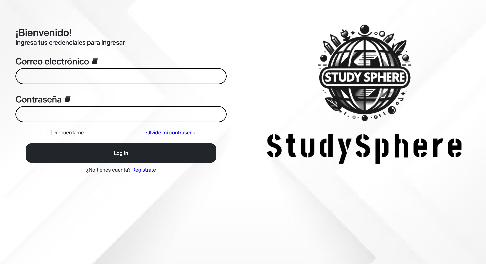
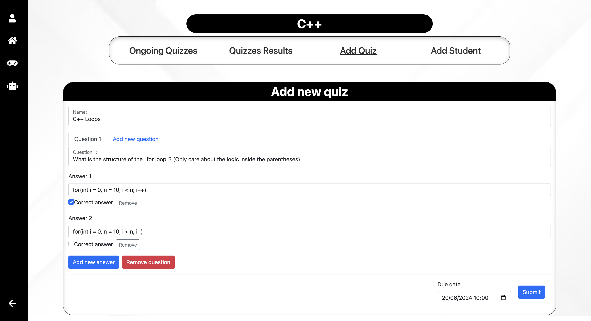
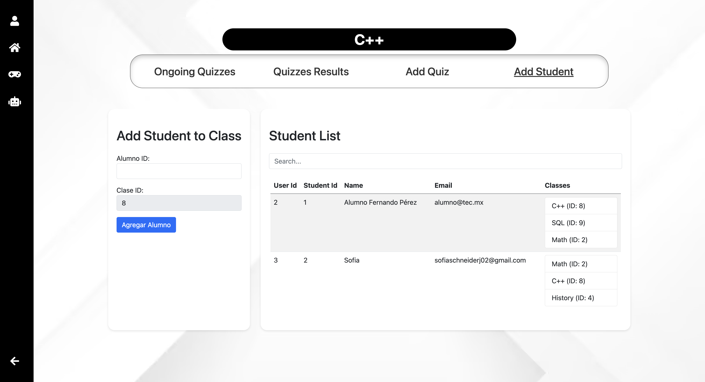
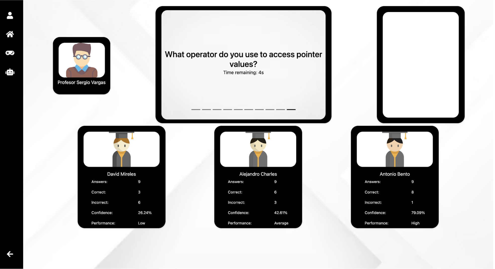
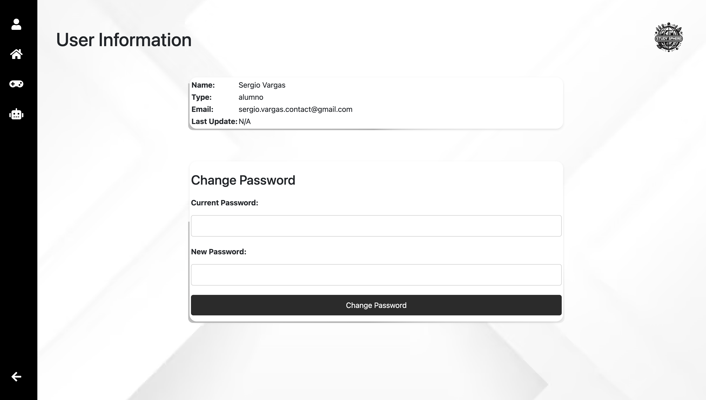
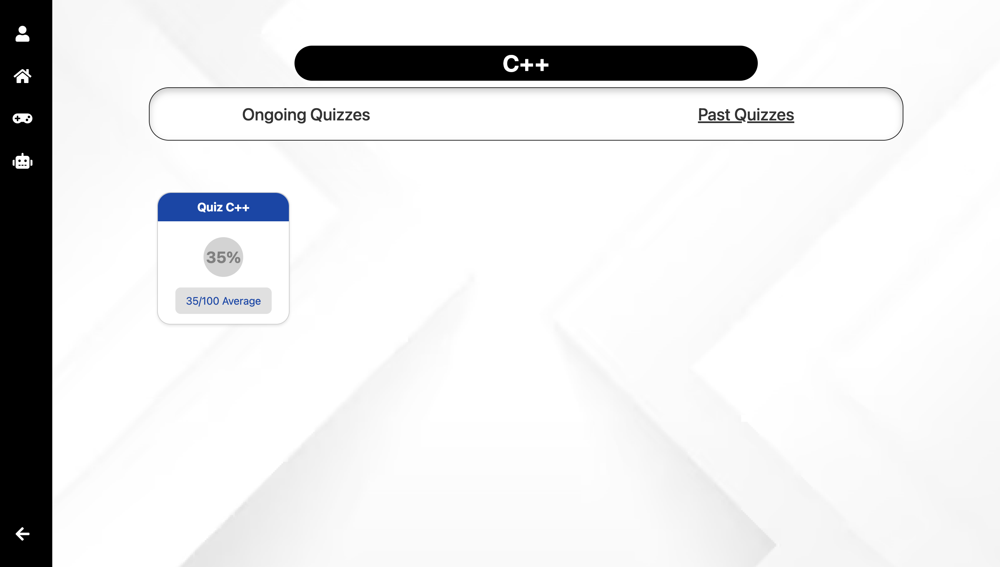
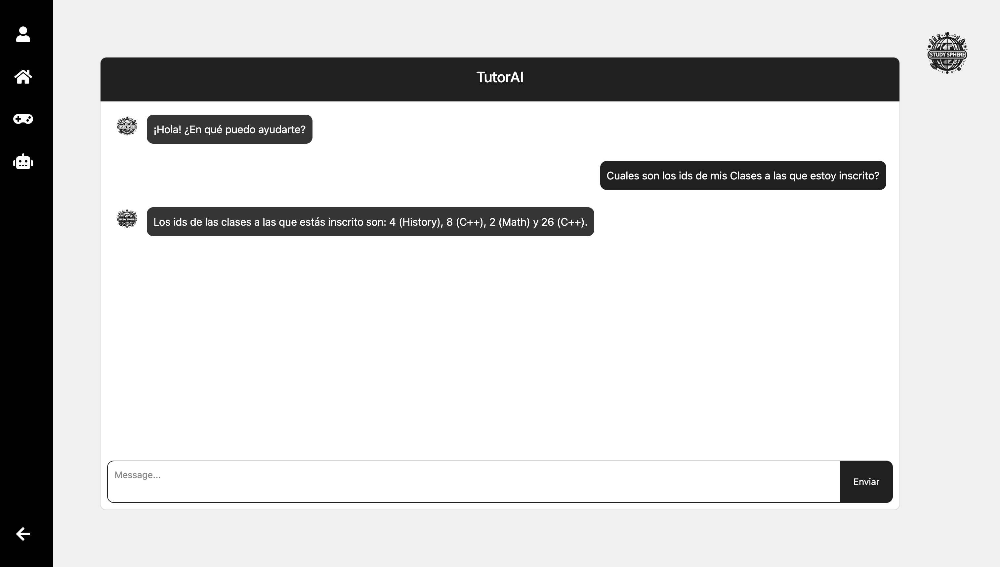

# StudySphere

  

## Purpose

StudySphere was created with the goal of revolutionizing the educational experience by integrating modern technology to provide personalized, engaging, and effective learning. The platform aims to motivate students through interactive avatars, real-time feedback, and a gamified environment that makes learning fun and dynamic. By incorporating adaptive AI, StudySphere offers tailored feedback and interactions that cater to individual learning styles and needs.

## Key Features

* **Comprehensive Class Management:** The platform allows educators to manage classes, enroll students, and monitor their progress efficiently, all within a user-friendly interface.

* **Interactive Avatars and Gamification:** The platform features engaging avatars and gamified elements that make learning more enjoyable. Students earn points and badges, encouraging consistent participation and effort.
  
* **Personalized Learning:** Utilizing OpenAI, StudySphere adapts to each student's learning behavior, providing customized feedback and suggestions to enhance their learning experience.

* **Real-time Scoring and Feedback:** Quizzes and assignments are scored in real-time, allowing students to receive immediate feedback and track their progress instantly.

* **Astro Blast Game:** To help students manage stress, StudySphere includes a game called Astro Blast, developed with Unity and C#. This game provides a fun and engaging way for students to unwind and take a break from their studies.

## Technology Stack

* **Front-end:**
 
* **Back-end:**

* **Database:** PostgreSQL
* **Hosting:** Vercel
* **AI Integration:** OpenAI for adaptive interactions
* **Game Development:** Unity and C# for the Astro Blast game

## Contribution

### To the Problem:

StudySphere addresses several critical issues in modern education. Traditional learning methods often fail to engage students, leading to decreased motivation and participation. By integrating gamification and interactive elements, StudySphere transforms the learning experience into an engaging and dynamic process. The platform’s use of adaptive AI ensures that each student receives personalized feedback and guidance, addressing their unique learning needs and helping to close knowledge gaps more effectively than one-size-fits-all approaches.

### To Schools:

For educational institutions, StudySphere offers a comprehensive solution to enhance both teaching and administrative processes. The platform simplifies class management, student enrollment, and progress tracking, making it easier for educators to focus on teaching rather than administrative tasks. The real-time scoring and feedback features allow teachers to monitor student performance continuously, identify areas where students struggle, and adjust their teaching strategies accordingly. Additionally, the inclusion of the Astro Blast game provides a valuable tool for schools to support student well-being by offering a fun way to relieve stress, thereby promoting a healthier, more balanced learning environment.

 
## Login/Register
 

# Teacher's Perspective

## Menu/Profile Information/Add Class

  

  

## Ongoing Quizzes

  

## Quizzes Results

  

## Add Quiz

  

## Add Student

  

## Quiz Simulation

  

# Student's Perspective

## Menu/Profile Information

   

## Ongoing Quizzes

  

## Past Quizzes

  

## Quiz Simulator

  

  

## Astro Blast

  

## Tutor AI

  

## Collaborators

* **@ferpo3**
* **@SofiaSchneider-dev**
* **@Alejandrocharles**
* **@mirelesDavid**
* **@mnoriega-mx**
* **SergioVargasDev**

